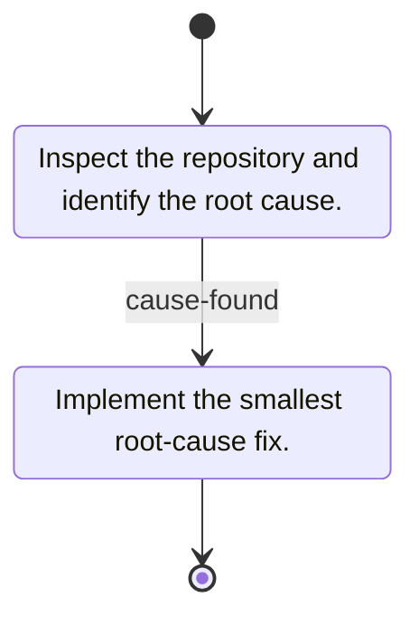

# Pi Prompt Machine ⚙️

[](https://www.npmjs.com/package/pi-prompt-machine)
[](https://pi.dev/packages/pi-prompt-machine)

Pi Prompt Machine turns Mermaid state diagrams into progressive coding workflows. The agent sees one state at a time, completes its instruction, and follows an outgoing transition before receiving the next instruction.

This keeps long workflows out of the prompt until each step becomes relevant.

## Install

```sh
pi install npm:pi-prompt-machine
```

To try the extension without installing it:

```sh
pi -e npm:pi-prompt-machine
```

The package also includes the `skill-to-prompt-machine` skill. Ask Pi to turn an
existing skill into a prompt machine, or invoke it directly:

```text
/skill:skill-to-prompt-machine <skill name or path>
```

It writes the generated Mermaid file to `~/.pi/agent/prompt-machines/`.

## Create a prompt machine

Store each machine as either a Mermaid file or a directory with a `MACHINE.mmd` entrypoint:

```text
~/.pi/agent/prompt-machines/
├── code-brain-planning.mmd
└── fix-and-push/
    ├── MACHINE.mmd
    └── templates/
        └── report.md
```

The filename or directory name becomes the machine name. Names may contain letters, numbers, `_`, and `-`. The names `state` and `transition` are reserved. If both layouts define the same name, the flat `.mmd` file wins.

Directory machines may contain nested supporting files, such as references or output templates, for their prompts to reference. These files are not loaded automatically or discovered as separate machines; only `MACHINE.mmd` is the entrypoint.

A small machine looks like this:



## Run a prompt machine

Start a machine by name:

```text
/prompt-machine fix-and-push
```

Add a task prompt after the name to give the workflow a concrete objective:

```text
/prompt-machine code-brain-planning Wrap the repository tests in appropriate describe blocks
```

The task prompt appears once in the initial user message. Each later message contains only the current state instruction and its outgoing transitions.

Inspect the current state without advancing it:

```text
/prompt-machine state
```

Advance manually when needed:

```text
/prompt-machine transition
/prompt-machine transition cause-found
```

The agent must advance through `prompt_machine_transition` when the current instruction is complete:

- With one outgoing edge, it calls the tool without a transition name.
- With multiple edges, it must choose the transition that matches the outcome of its work and pass that transition name. Omitting the name is rejected.

Use outcome-oriented transition names. Names such as `tests-passed`, `changes-needed`, and `user-approved` give the agent a meaningful choice; phase names such as `next` do not.

Transitions assert that a step is complete. They do not independently verify tests, commits, deployments, or other state instructions.

## Example: approval-first planning

This machine gathers context, handles optional domain modeling, prepares and reviews a plan, waits for approval, implements it, reviews the result, and commits the verified change.

```mermaid
stateDiagram-v2
  [*] --> build_context

  state "Resolve the Code Brain project folder and next numbered plan directory. Launch asynchronous scout and context-builder subagents with distinct scopes; add a researcher only when external evidence materially affects the plan. Persist useful findings in notes.md and create a canvas when flow, ownership, state, or boundaries matter. Do not delegate artifact persistence or orchestration." as build_context
  build_context --> capture_domain: domain-modeling-needed
  build_context --> challenge_direction: context-ready-no-domain-changes

  state "Invoke domain-modeling. Challenge conflicting or fuzzy language, cross-check claims against source code, and persist resolved terms under domain/. Create and link an ADR only for a hard-to-reverse, surprising decision with real alternatives." as capture_domain
  capture_domain --> challenge_direction: domain-captured

  state "Decide whether assumptions, architecture, scope, or trajectory need a second opinion. When they do, run a forked oracle as a read-only adviser and explicitly accept or reject its recommendations before planning; otherwise record that no meaningful directional decision requires an oracle." as challenge_direction
  challenge_direction --> draft_plan

  state "Give the gathered context and approved direction to a planner that must not edit code. Persist and refine plan.md as a standalone fresh-worker handoff containing the goal, context, exact files, TDD-first steps, important end-state snippets, verification commands, risks, blocking user questions, and links to every sibling artifact and relevant ADR. Always create and link call-stack.diagram.md; create proposed.canvas and current.canvas only when useful. Do not leave conditional implementation forks in the plan." as draft_plan
  draft_plan --> review_plan

  state "Adversarially review the plan against the request and evidence with a fresh read-only reviewer when risk is meaningful; otherwise self-review. Incorporate accepted feedback without revision-history residue and ensure the plan is complete, concrete, linked, TDD-first, and executable by a worker with no prior context." as review_plan
  review_plan --> approval_gate: plan-ready
  review_plan --> draft_plan: changes-needed

  state "Present the standalone plan and wait for the user. Do not edit implementation files before explicit approval. If the user requests changes, update the plan so it remains self-contained and review it again." as approval_gate
  approval_gate --> implement: user-approved
  approval_gate --> draft_plan: revision-requested
  approval_gate --> [*]: cancelled

  state "Launch one fresh-context worker asynchronously with the approved plan, explicit acceptance criteria, verification commands, and a required handoff covering changed files, command exit codes, validation evidence, residual risks, and decisions needing approval. Ensure the worker implements the approved plan rather than inventing another design." as implement
  implement --> review_implementation

  state "Launch fresh read-only reviewers with distinct correctness, validation, and simplicity angles. Synthesize their findings, inspect the final diff, and confirm focused verification. Choose the transition matching whether approved fixes remain." as review_implementation
  review_implementation --> apply_fixes: fixes-needed
  review_implementation --> commit: implementation-approved

  state "Launch one forked worker to apply only the accepted fixes, run focused verification, and return the implementation for another read-only review." as apply_fixes
  apply_fixes --> review_implementation

  state "After all verification passes, generate a Conventional Commit message, commit the implementation and related Code Brain artifacts, and confirm git status contains no uncommitted work from the change." as commit
  commit --> [*]
```



Save it as `~/.pi/agent/prompt-machines/code-brain-planning.mmd`, then run:

```text
/prompt-machine code-brain-planning <your task>
```

## Authoring requirements

Prompt Machine accepts flat `stateDiagram` and `stateDiagram-v2` workflows with:

- exactly one start edge;
- at least one reachable end edge;
- an explicit instruction for every state;
- reachable states with valid targets;
- unique transition names per state;
- names on every edge when a state has multiple outcomes.

Composite and concurrent states, groups, fork/join/choice nodes, click directives, and symlinked machine files are not supported.

## Sessions and branches

Prompt Machine stores an immutable machine snapshot when a workflow starts. Editing the source file does not alter a running workflow.

State checkpoints follow Pi's session tree. Returning to an earlier point with `/tree` restores the machine state from that branch without leaking instructions from an abandoned branch.
