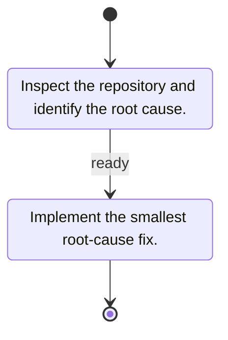

# Pi Prompt Machine

A Pi package for progressive-disclosure coding workflows described by flat Mermaid state diagrams. It uses Effect 4 and Node platform services at runtime; Bun drives development.

## Setup

```sh
bun install
pi -e .
```

Create machines as direct files in `~/.pi/agent/prompt-machines/` (or the directory selected by `PI_CODING_AGENT_DIR`):



Names may contain letters, numbers, `_`, and `-`; `state` and `transition` are reserved. Nested files, symlinks, and invalid filenames are ignored.

## Commands and tool

- `/prompt-machine <name>` starts or replaces a workflow and sends only its first instruction to the agent.
- `/prompt-machine transition [name]` asserts completion and advances. A name may be omitted only for one outgoing edge.
- `/prompt-machine state` displays machine, status, source, current instruction, and outgoing targets without triggering a turn or revealing future instructions.
- Agents call `prompt_machine_transition` after completing the disclosed instruction. With one outgoing edge, no transition name is needed. With multiple edges, the agent chooses the transition that best matches the outcome of its work and passes that transition name.

Transition calls assert completion; they do not independently verify it. Use outcome-oriented transition names so the agent can select the appropriate branch. Workflow starts contain an immutable parsed snapshot, while subsequent checkpoints are lightweight. Pi custom entries restore the correct state when resuming or navigating branches with `/tree`.

## Authoring rules

Only global, flat `stateDiagram` and `stateDiagram-v2` workflows are accepted. Provide exactly one start edge, at least one terminal end edge, a non-empty explicit instruction for every ordinary state, valid targets, reachable states, and unique transition names. Every edge on a multi-edge branch must be named. Composite/concurrent states, groups, fork/join/choice nodes, click directives, and other non-flat structures are rejected.

Instructions are untrusted user content and are delivered as user context, never as system-prompt text. The model receives only the current instruction and outgoing transition names; `/prompt-machine state` is user-only detail.

## Development

```sh
bun run test:unit
bun run test:integration
bun run test:coverage
bun run format
bun run lint
bun run typecheck
```

The Mermaid adapter pins `mermaid@11.16.0` and `happy-dom@20.10.6`. It temporarily installs browser globals with an Effect-managed acquire/use/release bracket, then decodes the internal `mermaidAPI.getDiagramFromText().db.getData()` result through Effect Schema. That API is deprecated/internal, so the real integration test protects the boundary and the dependency versions must remain pinned.
